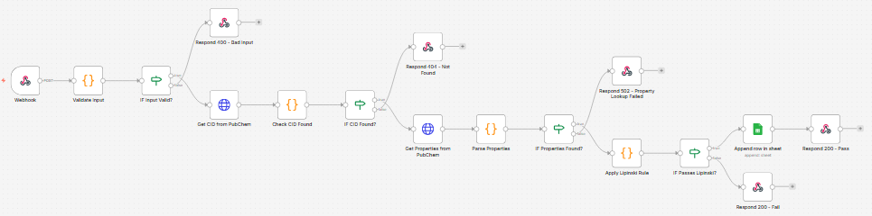

# n8n Automation Examples

## Compound Lipinski Lookup

A webhook-triggered n8n workflow: given a compound name, it looks up the
compound on PubChem, retrieves its physicochemical properties, applies
Lipinski's Rule of Five, and logs passing compounds to a Google Sheet —
with explicit error handling for invalid input, compounds PubChem can't
resolve, and property-lookup failures.

### About this workflow

This workflow was designed collaboratively (with AI assistance) based on
the logic in my `pubchem-metabolite-descriptor-fetcher` Python repository,
then imported, configured, debugged, and tested end-to-end by me. It's a
portfolio demonstration, not an exported real-client workflow — I don't
currently have a shareable client deliverable available. It is also not
connected to my published research.

### What it does

1. **Webhook** receives a POST request with a `compound_name`
2. **Validates** the input isn't empty — responds `400` if it is
3. **Looks up the PubChem CID** for the compound name
4. **Checks the CID was found** — PubChem returns a `Fault` object (not a
   standard HTTP error) when a compound name doesn't resolve; the workflow
   checks for this explicitly and responds `404` if so
5. **Fetches molecular properties** (molecular weight, LogP, H-bond
   donors/acceptors, TPSA, SMILES) for the resolved CID
6. **Checks the properties were returned** — responds `502` if that lookup failed
7. **Applies Lipinski's Rule of Five** to the returned properties
8. **Branches on the result:**
   - **Passes** → logs the compound and its properties to a Google Sheet, then responds `200` with the full result
   - **Fails** → responds `200` with the full result, no logging

### Workflow diagram



### Tested scenarios

| Input | Expected behavior | Result |
|---|---|---|
| `Aspirin` | Passes Lipinski, logs to sheet, `200` | ✅ Confirmed |
| `Cyclosporine` | Fails Lipinski (MW > 500), `200`, no log | ✅ Confirmed |
| `{}` (empty body) | `400` — missing compound name | ✅ Confirmed |
| `Notarealcompoundxyz123` | `404` — not found in PubChem | ✅ Confirmed |

### Build notes

The Google Sheets node needed real configuration after import — connecting
my own OAuth credential, pointing it at an actual spreadsheet, and
re-mapping the column values. That's expected: a workflow export can't
carry someone else's spreadsheet ID or auth token. Everything else in the
workflow imported and ran as designed.

### Setup

1. Import `workflows/compound_lipinski_lookup.json` into your own n8n instance.
2. Open the **"Append row in sheet"** node and:
   - Connect your own Google Sheets credential
   - Replace the placeholder document ID with your own spreadsheet's ID
   - Create a tab named `Lipinski Hits` with columns: `compound_name`, `molecular_weight`, `logp`, `smiles`, `timestamp`
3. Activate the workflow and test with the requests below.

### Try it yourself

```bash
# Passes Lipinski
curl -X POST http://localhost:5678/webhook/compound-lookup \
  -H "Content-Type: application/json" -d '{"compound_name": "Aspirin"}'

# Fails Lipinski
curl -X POST http://localhost:5678/webhook/compound-lookup \
  -H "Content-Type: application/json" -d '{"compound_name": "Cyclosporine"}'

# Invalid input
curl -X POST http://localhost:5678/webhook/compound-lookup \
  -H "Content-Type: application/json" -d '{}'

# Compound not found
curl -X POST http://localhost:5678/webhook/compound-lookup \
  -H "Content-Type: application/json" -d '{"compound_name": "Notarealcompoundxyz123"}'
```

### File structure

```
n8n-automation-examples/
├── workflows/
│   └── compound_lipinski_lookup.json
├── workflow_screenshot.png
└── README.md
```
